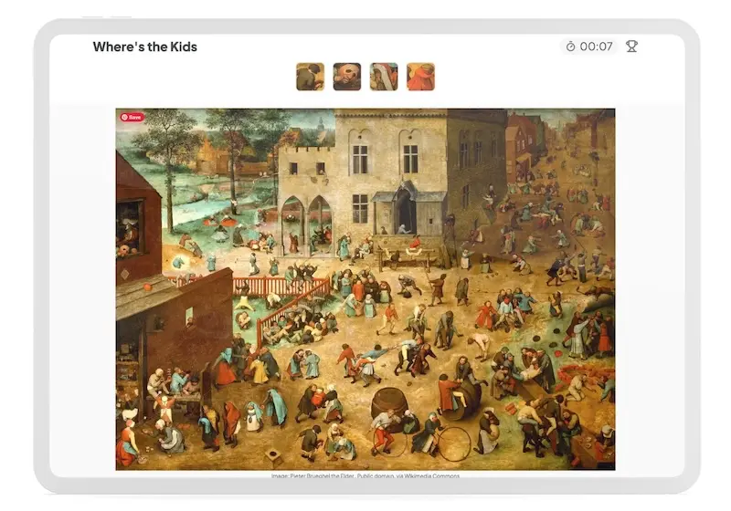

# The Odin Project: Where's Waldo (A Photo Tagging App)

 
  

      
  

 

This is a **fullstack photo-tagging project** that creates a game similar to *Where's Waldo?*. The main goal of the project is to predefine each target's position on the image, store those target areas in the database, and use the backend to validate the player's guesses during the game. 

For the full assignment details, see: [Project: Where's Waldo (A Photo Tagging App)](https://www.theodinproject.com/lessons/nodejs-where-s-waldo-a-photo-tagging-app).

## Key Project Instructions

**Planning**  
- Plan the overall app structure before starting development.

**Frontend Functionality**
- First, build the game functionality on the frontend.
- Display a target selection UI when the player clicks on the image. 

**Coordinate Validation**
- Normalize coordinates so the game works across different screen size. 
- Use the backend to validate the target coordinates. 
- Display a marker on the image when the player chooses the correct target. 
 
**Time Tracking**
- Track the player's completion time as their score. 
- Show a popup that allows players to enter their name, with an alternate option for players who do not submit one. 
- Use the recorded completion times to rank players on the leaderboard.  

## Built With

- HTML
- CSS
- Javascript
- Vite
- Prisma ORM
- PostgreSQL
- Express
- cors
- Neon
- Render